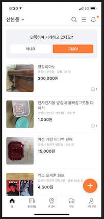
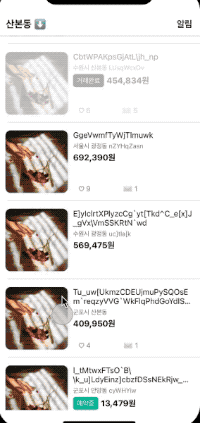
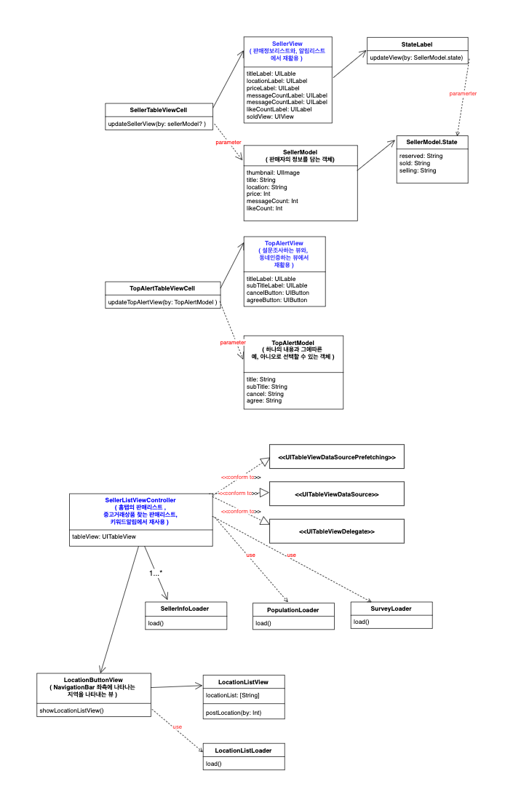

## 1.구현하고자하는 화면 
당근마켓의 홈탭에있는 ``판매리스트``를 구현하고자합니다.

## 2.동작화면

## 3.기능
테이블뷰를 통해 ``판매자정보 리스트``를 보여줍니다.
* 좀더 실제앱처럼 구현 하기위해, [``랜덤이미지를 가져오는 API``](https://source.unsplash.com/)를 이용하여, Mock 판매정보를 만들어서 테이블뷰에  뿌려주고있습니다. 
* 마찬가지로, 실제앱처럼 판매물품이 ``예약중``인지, ``거래완료``인지등을 표시해주었습니다. 
* 당근마켓어플처럼 ``무한스크롤``이 가능하도록 구현했습니다. 

최상단에 ``설문조사``나, ``지역인증``이 나타나도록 했습니다.
* 설문조사, 지역인증뷰가 같은뷰를 사용해도 된다라고 판단하여 뷰를 ``재활용``했습니다. 

네비게이션탭의 좌측에있는 지역을 클릭하면 약간의 애니메이션과 ``지역리스트``가 나타나도록 했습니다.
* 산본동이 아닌경우에는 최상단에 지역인증이 나타나도록 했습니다.

네비게이션탭 우측-알림-키워드알림에서 ``알림리스트``를 보여주도록했습니다. 
* 알림리스트와 판매자정보리스트가 동일한 뷰를 사용해도 된다라고 판단하여 뷰를 ``재활용``하여 사용했습니다. 

## 4.클래스 다이어그램 

